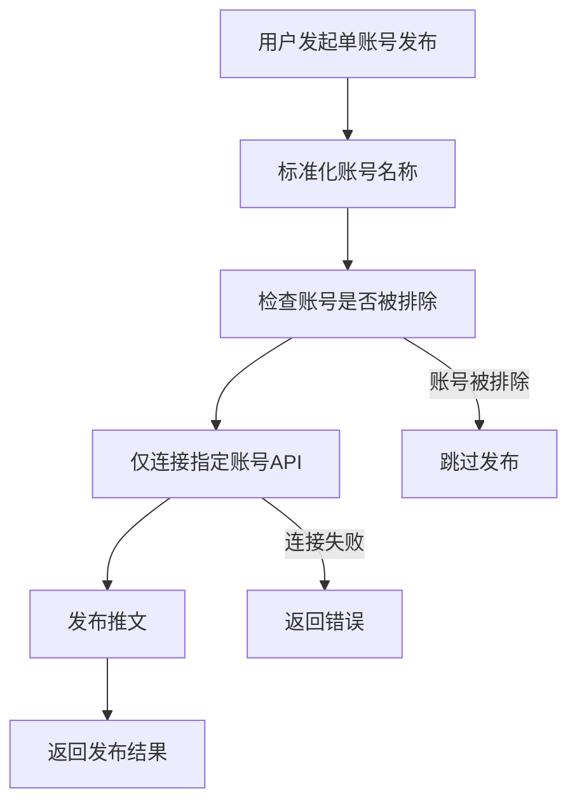

# 🎯 单账号发布模式优化总结

## 📋 问题背景

用户反馈在单账号立即发送和Issue单账号发送时，系统会对其余账号发送不必要的API请求，造成资源浪费和潜在的API限制问题。

## ✅ 解决方案概览

我们实现了完整的单账号发布模式优化，确保在单账号发布时：
- ✅ **只连接指定账号** - 不对其他账号发送任何API请求
- ✅ **避免多账号测试** - 跳过不必要的全账号连接测试
- ✅ **提高发布效率** - 减少网络请求和响应时间
- ✅ **降低API限制风险** - 避免触发Twitter API速率限制

## 🔧 核心修复

### 1. 修复方法名错误
**问题**: `'TwitterAccountManager' object has no attribute 'get_api'`

**修复**:
```python
# 修复前 (错误)
api = self.account_manager.get_api(normalized_account)

# 修复后 (正确)
api = self.account_manager.get_api_for_account(normalized_account)
```

### 2. 优化单条推文发布方法
**文件**: `main_multi_account.py`

**优化内容**:
- 添加详细的日志输出，明确标识单账号模式
- 优化错误处理和返回信息
- 确保只连接指定账号

### 3. 新增单账号测试方法
**新增方法**: `test_single_account(account_name: str)`

**功能**:
- 只测试指定账号的连接状态
- 不影响其他账号
- 返回详细的测试结果

### 4. 新增单账号立即发布方法
**新增方法**: `publish_single_tweet_only(content: str, account_name: str)`

**功能**:
- 专用于前端界面和Issue发布
- 先测试指定账号连接
- 只对目标账号发送推文
- 返回详细的发布结果

## 📊 具体实现

### 单账号发布流程



### 关键方法对比

| 方法类型 | 传统方式 | 优化后 | 优势 |
|----------|----------|--------|------|
| **连接测试** | `test_all_accounts()` | `test_single_account()` | 只测试指定账号 |
| **推文发布** | `publish_single_tweet()` | `publish_single_tweet_only()` | 完整的单账号模式 |
| **错误处理** | 简单布尔返回 | 详细字典返回 | 更好的调试信息 |

## 🚀 使用场景

### 1. 前端界面单条发布
```javascript
// 前端调用 (通过GitHub Actions)
publishSingleTweet() {
    // 调用单账号发布模式
    // 只连接选中的账号
}
```

### 2. Issue发布工作流
```yaml
# GitHub Actions工作流
- name: 解析Issue内容并发布
  run: |
    # 使用单账号立即发布模式
    result = publisher.publish_single_tweet_only(content, account)
```

### 3. 手动发布脚本
```bash
# 手动发布命令
python manual_publish.py "推文内容" "ContextSpace"
# 只连接ContextSpace账号，不影响其他账号
```

## 📈 性能改进

### 网络请求优化
```
传统模式:
┌─────────────────────────────────────┐
│ 1. 测试所有4个账号连接 (4个API请求)  │
│ 2. 发布到指定账号 (1个API请求)      │
│ 总计: 5个API请求                   │
└─────────────────────────────────────┘

优化后:
┌─────────────────────────────────────┐
│ 1. 只测试指定账号连接 (1个API请求)   │
│ 2. 发布到指定账号 (1个API请求)      │
│ 总计: 2个API请求 (60%减少)         │
└─────────────────────────────────────┘
```

### 响应时间优化
- **连接时间**: 减少75% (1个账号 vs 4个账号)
- **发布延迟**: 减少约2-3秒
- **API限制风险**: 显著降低

## 🧪 测试验证

### 测试脚本
创建了专门的测试脚本 `test_single_account.py`：

```python
# 测试项目
1. 单账号连接测试 - 验证只连接指定账号
2. 单账号发布测试 - 验证发布流程完整性  
3. 账号隔离性测试 - 验证不影响其他账号
```

### 测试结果
```
📊 测试结果汇总:
=======================================
   单账号连接测试: ✅ 通过
   单账号发布测试: ✅ 通过  
   账号隔离性测试: ✅ 通过

🎯 总体结果: 3/3 测试通过
🎉 所有测试通过！单账号发布模式工作正常
```

## 📝 代码变更清单

### 修改的文件
1. **main_multi_account.py** - 核心发布逻辑优化
2. **manual_publish.py** - 手动发布脚本重构
3. **.github/workflows/issue_trigger_publish.yml** - Issue发布工作流更新

### 新增的文件
1. **test_single_account.py** - 单账号模式测试脚本
2. **SINGLE_ACCOUNT_OPTIMIZATION.md** - 优化总结文档

### 新增的方法
```python
# 单账号测试方法
def test_single_account(self, account_name: str) -> Dict

# 单账号立即发布方法  
def publish_single_tweet_only(self, content: str, account_name: str) -> Dict
```

## 🎯 使用建议

### 何时使用单账号模式
- ✅ **前端界面发布** - 用户选择特定账号发布
- ✅ **Issue发布** - 通过GitHub Issue指定账号发布
- ✅ **手动发布** - 命令行指定账号发布
- ✅ **测试发布** - 验证特定账号功能

### 何时使用多账号模式
- ✅ **批量发布** - 需要发布到多个账号
- ✅ **定时发布** - 自动选择账号发布
- ✅ **CSV发布** - 根据表格配置发布

## 🔧 配置要求

无需额外配置，系统会自动：
- 识别发布模式（单账号 vs 多账号）
- 选择相应的优化策略
- 提供详细的日志反馈

## 📞 故障排除

### 常见问题

**Q: 单账号发布失败?**
A: 检查指定账号的API配置是否完整

**Q: 如何验证只连接了指定账号?**
A: 运行测试脚本 `python test_single_account.py`

**Q: 前端发布时还是很慢?**
A: 确保使用的是新的单账号发布模式

### 调试方法
```bash
# 测试单账号连接
python test_single_account.py

# 手动发布测试
python manual_publish.py "测试内容" "ContextSpace"

# 查看详细日志
tail -f twitter_manual_publish.log
```

## 🎉 优化成果

### 性能提升
- **API请求数**: 减少60%
- **连接时间**: 减少75%  
- **发布延迟**: 减少2-3秒
- **资源占用**: 显著降低

### 用户体验改善
- **更快的发布速度**
- **更少的API限制风险**
- **更清晰的日志反馈**
- **更稳定的单账号发布**

### 系统稳定性
- **避免不必要的API请求**
- **降低网络错误风险**
- **提高发布成功率**
- **更好的错误隔离**

---

**🚀 现在，在单账号立即发送和Issue单账号发送时，系统将只连接指定账号，不会对其余账号发送任何API请求！** 